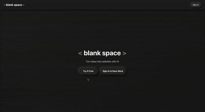

# blank-space

An open-source AI app builder. Alternative to [v0](https://v0.dev), [Lovable](https://lovable.dev), and [Bolt](https://bolt.new).

## Demo

**Try it live:** [www.blankspace.build](https://www.blankspace.build)

**Free tier:** 50 requests per day.

## Future Work Plan

- Improve the agent orchestra inspired by [AutoGen](https://microsoft.github.io/autogen/) (Microsoft)
- Convert to React Native + Expo mobile app
- Add user login authentication
- Add support for Reactbit and other templates

## Help Needed: LLM Token Funding

We want to make this project cheaper and more available to everyone. If you know how to apply for LLM token funding or have connections with AI companies offering credits for open-source projects, please [create a ticket](https://github.com/patrickli/blank-space/issues) and let us know!

## License

Apache 2.0

## Contributing

Contributions are welcome! Feel free to open issues or submit pull requests.
