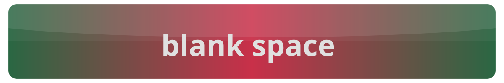
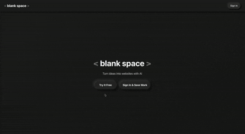

<p align="center">
  
</p>

<p align="center">
  🎄 <strong>Open source alternative to</strong> <a href="https://v0.dev">v0</a>, <a href="https://lovable.dev">Lovable</a>, and <a href="https://bolt.new">Bolt</a> 🎄
</p>

<p align="center">
  <a href="https://github.com/BrandeisPatrick/blank-space/stargazers">
    
  </a>
  <a href="https://github.com/BrandeisPatrick/blank-space/issues">
    
  </a>
  <a href="https://github.com/BrandeisPatrick/blank-space/blob/main/LICENSE">
    
  </a>
  
</p>

<p align="center">
  <strong>Try it live:</strong> <a href="https://www.blankspace.build">www.blankspace.build</a>
</p>

---

## ✨ What is Blank Space?

Blank Space is an open-source AI app builder focused on speed and simplicity:
- **Visual flow to app** — create useful AI flows quickly.
- **Composable agents** — orchestrate tools/functions with an extendable core.
- **Bring your own UI** — drop in components or templates you already love.
- **Self-hostable** — run locally or deploy to your favorite platform.

---

## 🎬 Demo

<p align="center">
  
</p>

---

## 🚀 Quick Start

```bash
# 1) Clone
git clone https://github.com/BrandeisPatrick/blank-space
cd blank-space

# 2) Configure (optional: copy and fill in env values if needed)
cp .env.example .env

# 3) Install & run
npm install
npm run dev
# open http://localhost:5173  (or the port shown in your terminal)
